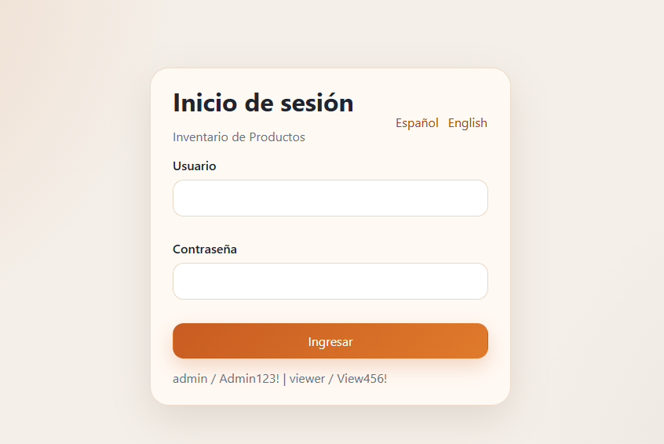
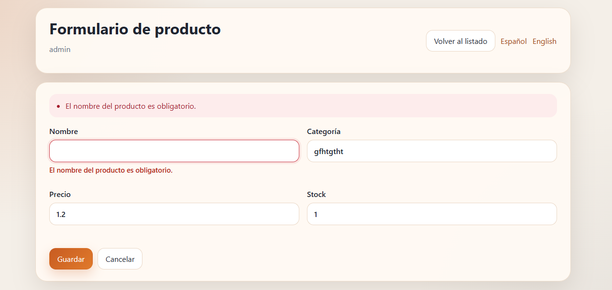
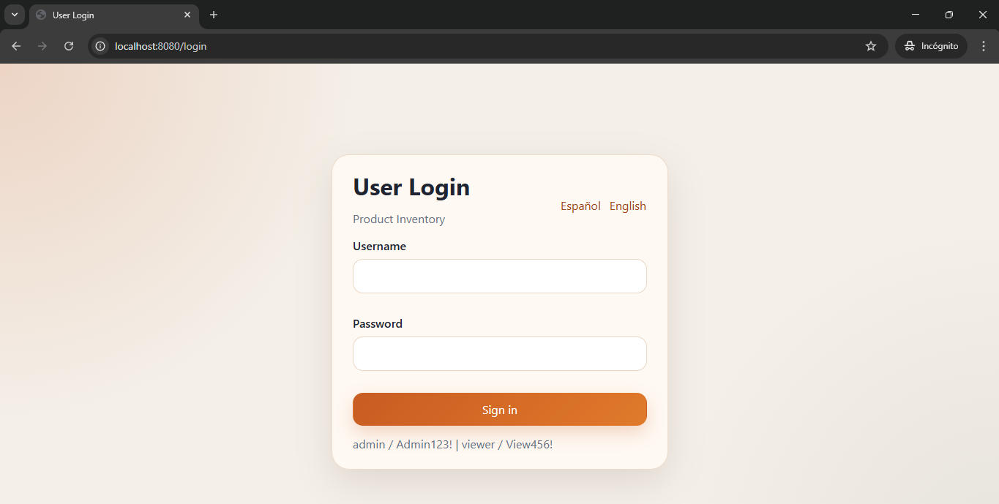
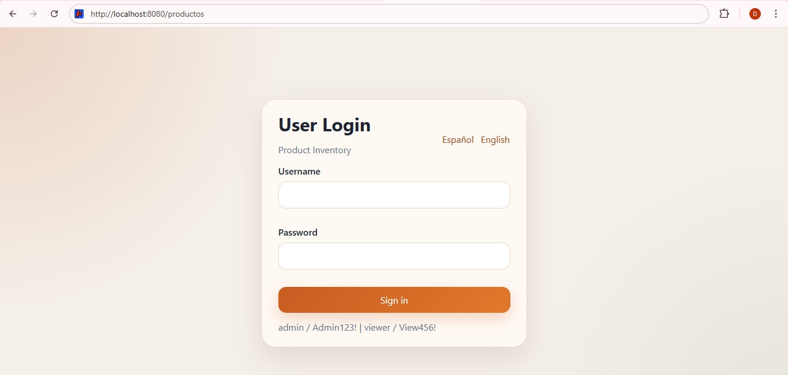
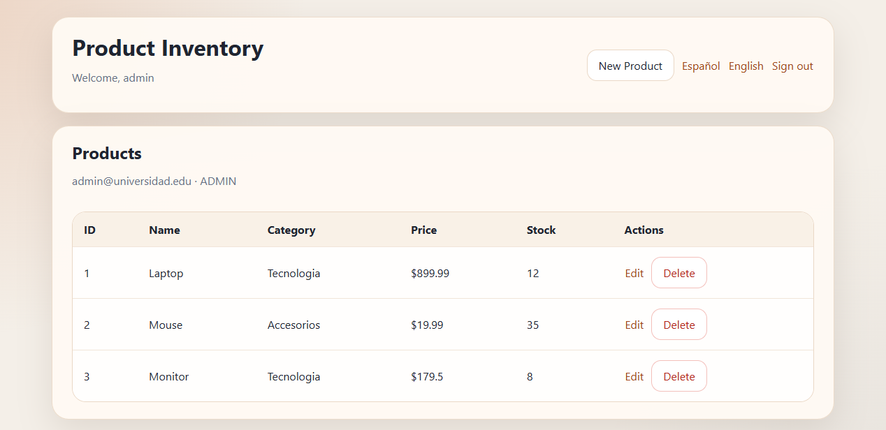

# Cardenas Post 2 U6

Aplicación Java Web con MVC para la Unidad 6. Incluye autenticación por sesión, CRUD de productos con validaciones en servidor, mensajes de error por campo e internacionalización básica en español e inglés con selector persistido en sesión.

## Requisitos

- Java 11 o superior
- Maven 3.8 o superior
- Tomcat 9 compatible con `javax.servlet`

## Ejecución

1. Compila el proyecto con `mvn clean package`.
2. Despliega el WAR generado en Tomcat.
3. Abre la aplicación en el navegador y entra por `/login`.

## Capturas

### 1. Pantalla de Login

### 2. Listado de Productos - Sesión Activa

### 3. Internacionalización - Cambio a Español

### 4. Validaciones - Errores por Campo

### 5. Logout y Protección de Rutas

